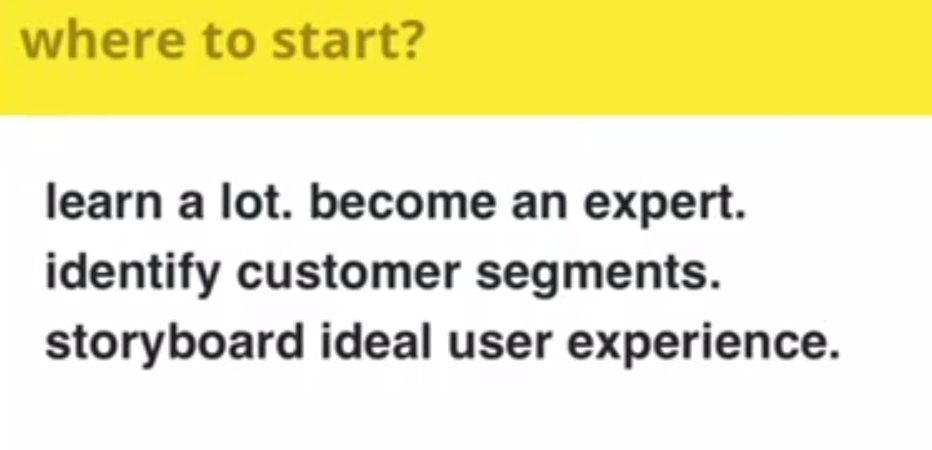
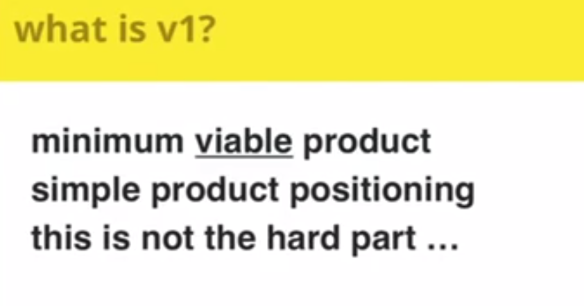
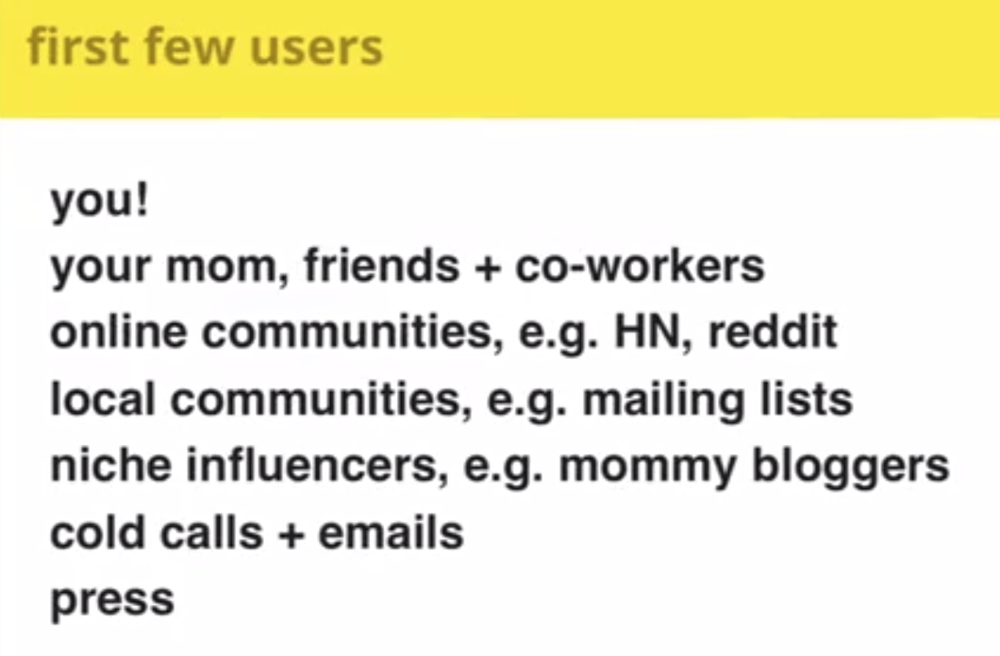
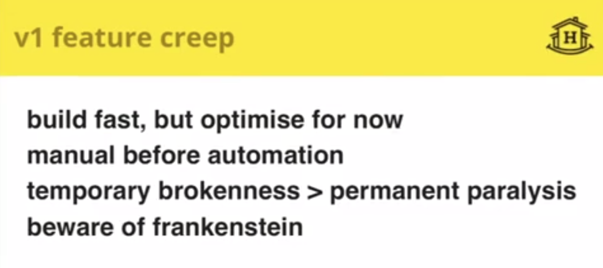
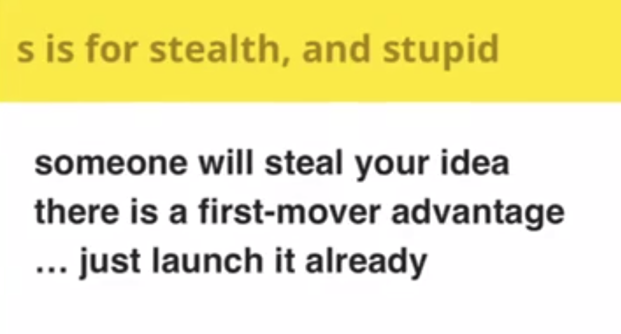
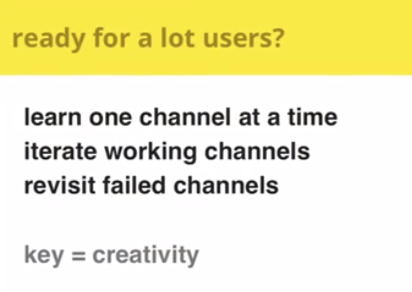
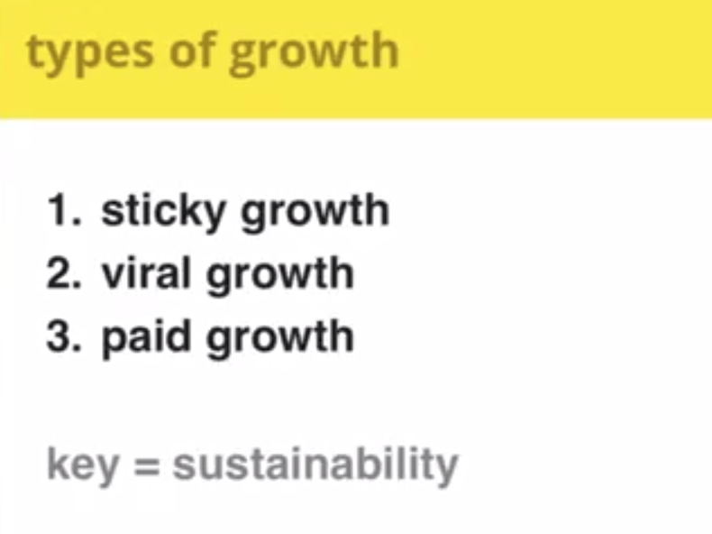
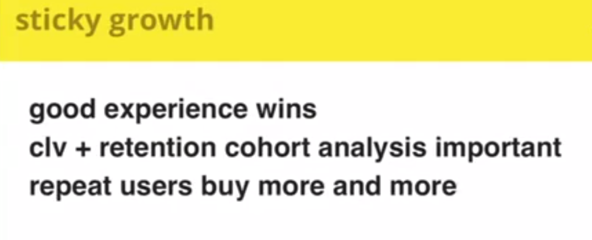

#Lecture 4: Building Product, Talking to Users, and Growing 
##Adora Cheung

Thanks for having me. Today I am going to be talking about how to go from zero users to many users. I'm just assuming that you have many great ideas in your head at this moment and you are thinking about what the next step is.

A lot of my lecture is based off of mistakes I have made in the past. As Sam mentioned, I went to YC in 2010 and spent three years going back and forth, pivoting a bunch of times, starting over a bunch of times, and I learned a lot about what not to do if I were to start another startup after Homejoy. A lot of my advice comes from failure and understanding what you shouldn't do and then using that to make generalizations about what you should do.

Just a reminder that you should take all advice as directionally good guidance, but every business is different. You're different, and I'm not you, so take everything with that in mind.

When you start a startup you should have a lot of time on your hands to concentrate on the startup. I'm not saying that you should quit school or quit work; what I'm saying is that you should have a lot of compressed time that is dedicated to immersing yourself in the idea and developing solutions to the problem that you are trying to solve. For example, if you're in school it is better to have one or two days straight per week to work on your idea versus spending two hours here and there every single day during the jus of the week. It's like coding. There is a lot of context switching so being able to really focus and immerse yourself is really important.

When I first wrote this lecture I was thinking, what are the things that most people do incorrectly when starting a startup? The novice approach is thinking, "I have this really great idea, I don't want to tell anyone about it. I'm going to build, build, build and then going to maybe tell one or two people and then I'm going to launch it on TechCrunch or somewhere like that, and then I'm going to get lots of users."

What really happens is because you did not get a lot of feedback, maybe you get a lot of people to your site, but no one sticks around because you didn't get that initial user feedback. If you're lucky enough to have some money in the bank you might go buy some users but it just whittles out over time and you just give up. It is sort of a vicious cycle. I actually did this once, and I did this while I was in YC. When I went through YC I didn't even launch a product. I didn't launch on TechCrunch which is the thing you should definitely do. You don't ever want to get into that cycle because you'll just end up with nothing good.

The next thing is that you have an idea and you should really think about what the idea is really solving. Like what is the actual problem. You should be able to describe your problem in one sentence. And then you should think, "How does that problem relate to me? Am I really passionate about that problem?" And then you should think, "Okay it's a problem I have, but is it a problem that other people have?" And you verify that by going out and talking to people.

One of the biggest mistakes I've made involves my co-founder and I, who is also my brother. We started a company called Pathjoy in 2009 or 2010. We had two goals in mind. One was to create a company that made people really happy, and to create a company that was very, very impactful. A good proxy for that is to just create a big huge company. And so we thought, okay, the problem we are solving is to make people happier. We first went to the notion of who are the people who make people happy. We came up with life coaches and therapists. It seemed kind of obvious to create a platform for life coaches and therapist. What happened as a result was that when we started using the product ourselves, we aren't cynical people by any means, but life coaches and therapists are just not people we would use ourselves. It was sort of useless to us. So it wasn't even a problem that we had and it wasn't something that we were super passionate about building out, yet we spent almost a year trying to do this. And so if you just start from T=0 and think about this before you build any product I think you can save yourself a lot of headache down the road from doing something you don't want to do.

So say you have a problem and you are able to state it, where do you start and how do you think of solutions? The first thing you should do is think about the industry that you are getting yourself into. Whether it is big or whether it is huge, you should really immerse yourself in that industry. And there are a number of ways to do this.

One is to really become a cog in that industry for a little bit. And so it might seem a little counterintuitive to do this because most people say that if you really want to disrupt an industry you should really not be a player in it. Someone who spent 20 or 30 years in an industry is probably set in their ways and is just used to the way things work and really can't think about what the inefficiencies are or the things that you can "disrupt". However, as a newbie coming into the industry you really should take one or two months to just really understand what all of the little bits and pieces of the industry are and how it works. Because it's when you get into the details, that's when you start seeing things that you can be exploiting and things that are really inefficient and may provide a huge overhead cost that you may be able to cut down.

So an example of this is that when we started Homejoy, we started with the cleaning industry, and when we started we were the cleaners ourselves. We started to clean houses and we found out really quickly that we were very bad cleaners. As a result, we said okay, we have to learn more about this and we went to buy books. We bought books about how to clean, which helped maybe a little bit. We learned a little more about cleaning supplies but it is sort of like basketball, you can read and learn about basketball but you're not going to get better at it if you don't actually train and throw a basketball into the net.

And so we decided that one of us was going to have to learn how to clean. Or at least get trained by a professional. We actually went to get a job at a cleaning company itself. The cool thing was I learned how to clean from training the few weeks that I was there at the cleaning company, but the even better thing was that I learned a lot about how a local cleaning company works. In that sense I learned why a local cleaning company could not become huge like Homejoy is today. And that is because they are pretty old school and they have a lot of things that are done inefficiently. Such as booking the customer and optimizing the cleaners' schedules was just done very inefficiently.

If you are in a situation like mine where there is a service element of it then you should go and do that service yourself. If your thing is related to restaurants you should become a waiter, if it is related to painting become a painter and kind of get in the shoes of your customers from all angles of what you are trying to build.

The other thing is there is also a level of obsessiveness that you should have with it as well. You should be so obsessed that you want to know what everybody in that space is doing. And it is things like writing a list of all of the potential competitors, similar types of companies, and Google searching them and clicking on every single link and reading every single article from search result number 1 to 1000. I found all potential competitors big and small and if they were public, I would go and read their S-1s, I would go read all of their quarterly financials, I would sit on earnings calls. You know most of these, you don't get much out of it but there are these golden nuggets that you will find every once in a while. And you won't be able to find that unless you actually go through the work of getting all that information in your head. You should become an expert in your industry. There should be no doubt when you are building this that you are the expert so that people trust you when you are building this product.

The second thing is identifying customer segments. Ideally at the end of the day you have built a product or business that everybody in the world is using. In the beginning, you realistically want to corner off a certain part of the customer base so that you can really optimize for them. It is just about focus and whether you are catering to teenage girls or whether it is soccer moms, you will be able to focus a lot on their needs.

And lastly, before you even create a product or before you put code down, you should really storyboard out the user experience of how you are going to solve the problem. And that is not just meaning the website itself, it also means how does the customer find out about you. It can be through an ad or word-of-mouth, and then they come to your site and they learn more about you. What does that text say and what are you communicating to them when they sign up for the project and when they purchase the service? What are they actually getting from your service or product? After they finish using the product or service do they leave a review or do they leave comments? You need to be able to go through that whole flow and visualize in your head what the perfect user experience is. And then put it down on paper and put it into code, and then start from there.

So, you have all these ideas in your head, now you kind of know what the core customer base is that you want to go after, and you know everything about the industry, what do you do next? You start building your product. The common phrase that most people use today is," You should build a minimum viable product." And I underlined viable because I think a lot of people skip that part and they go out with a feature and the whole user experience in the very beginning is flat. Minimal viable product pretty much means what is the smallest feature set that you should build to solve the problem that you are trying to solve. I think if you go through the whole storyboarding experience you can kind of figure that out very quickly. But again, you have to be talking to users, you have to be seeing what exists out there already, and what you should be building should solve their immediate needs.

And the second thing is that before you put things in front of the user you should really have your product positioning down. What I mean by that is that you should be able to go to a person and be able to say, "Hey, this does X,Y, and Z in one sentence." So for example, at Homejoy we started off with something super complicated. We were an online platform for home services, you start with cleaning and you can choose blah blah blah. It just went on for paragraphs and paragraphs.

When we went to potential users to come on our platform they would kind of get bored after the first few sentences. What we found out was that we needed a one-liner. The one-liner was very important. It kind of describes the functional benefits of what you do. In the future when you are trying to build a brand or whatnot you should be able to describe the emotional benefits and stuff like that. But when you are starting with no users you really need to tell them what they are going to get out of it. After we changed our position to get your place cleaned for $20 an hour, then everyone got it and we were able to get users in the door that way.

So you have an MVP out there, now how do you get your first few users to start trying it? The first few users should be obviously people you are connected with. You and your cofounder should be using it, your mom and dad should be using it, and your friends and coworkers should be using it. Beyond that, you want to get more user feedback. I've listed here some of the obvious places to go to depending on what you are selling. You can take your pick of the draw here. So, online communities, on Hacker News now there is the show HN - that's a great place. Especially if you are building tools for developers and things like that. Local communities - so if you're building consumer products you know there are a lot of influential local community mailing lists. Especially those for parents. Those are places you might want to hit up too.

At Homejoy we actually tried all of these. We used it ourselves and that was fine. We were the only cleaners so that was pretty easy. Our parents live in Milwaukee and we were based in Mountain View so that didn't work. Friends and coworkers were kind of like in San Francisco and elsewhere so we didn't have too many of them use it. So we actually ended up in a dead end of not being able to convince many people to use it in the beginning. So what we did was, because we are in Mountain View, some of you guys might know on Castro Street they have street fairs there during the summertime. So we would go out and basically chase down people and get them to try to book a cleaning. Almost everyone would say no until one day we just took advantage of the weather. It was a very hot and humid day and what we noticed was that everyone gravitated towards the food and drink area, especially on a hot day.

We figured we needed to get in the middle of that so we took water bottles and froze them and we started handing out free bottles of water that were cold. And people just came to us. I think we basically guilt tripped people into booking cleanings. But the proof in the pudding was that I figured most of the people were guilt tripped into doing it, but then they went home and they didn't cancel on us. Well, some of them did but the majority of them did not. I thought that's good, I have to go clean their houses but at least there is something we are actually solving here.

I know another startup in the last batch, I forgot their name right now, but they were selling shipping type products or trying to replace shipping products. So they would show up to the US postal office and find people who were trying to ship products and just take them out of line and get them to try to use the product and have them ship it for them. So you just have to go to places where people are really going to show up. Your conversion rate is going to be really low but to go from 0 to 1 to 3 to 4 these are the kind of things you might have to do.

So now that you have users using you ,what do you do with all of these users? The first thing you should do is make sure that there is a way for people to contact you. Ideally there is a phone number and if you put up a phone number, one good idea is to make sure that you have a voicemail so that you won't be picking it up all the time. But in any case a way for people to give inbound feedback is good, but really what you should be doing is going out to your users and talking to them. Get away from your desk and just get out and do the work. It seems like a slog and it is going to be a slog but this is where you are going to get the best feedback ever for your product. And this is where it is going to teach you what features you need to completely change, get rid of, or what features you need to build.

One way to do this is to send out surveys to get reviews after they have used the product. This is okay but generally people are only going to respond if they really love you or they really hate you. And you never get the in between. A way to get the in between and not all of the extremes is to actually meet the person that is using your product. I've seen people go out to meet the user and they sit there and it is like a laboratory and it is like an inquisition. You're just kind of poking at them. That is not going to give you the best results. What you should really do is make it into a conversation and get to know them and get them to feel comfortable. You want to get them at a level where they feel like they should be honest with you to help you improve things. So I found that actually taking people out for drinks and stuff like that was actually a very good way to do that. I'm not sure if all of you are old enough to do that but you can take them for coffee.

So another thing that you should be tracking is how are you doing in general from a macro perspective. The best way to do that is by tracking customer retention. The number of people that came in the door today, the number of people who are coming back tomorrow, the next day and so forth. Usually over time you are kind of looking at monthly retention so people who came in the door today, are they still using it next month and so forth. The problem with that metric is that it takes forever to collect that data and sometimes you don't have a month or two months or three months to figure that out. So a good leading indicator is actually collecting reviews and ratings. Such as five-star and four-star reviews or collecting some notion of nps, which is net promoter score. So you're basically asking them for a rating from 0 to 10 about how likely are they to recommend you to a friend and calculating the nps.

Over time what you'll see is that as you are building new features, you will be able to see that the reviews and the retention are going up over time. That means that you are doing a good job. If it is going down then you are doing a bad job. If it is kind of staying the same that probably means that you need to go out and figure out what new things you should be building.

One thing you should be wary of is the honesty curve. Some people will just lie to you. These are degrees of separation from you, and this is the level of honesty. So here this is your mom, these are the friends of your friends and here are random people. Your mom will use your product and she will be proud of you anyway, so she'll be honest this much. Your friends will be pretty honest with you and give you feedback because they care about you - this is assuming this is a free product - and then over time as you get more and more random, these people don't know who you are. There are people over here who don't care about giving you feedback. So take this into consideration when getting user feedback.

So say now this is a paid product. So when it is a paid product your mom is down here. She is just going to lie to you and tell you it's great. But then it kind of goes like this (draws graph going upward). Your friends are going to support you and give you the right feedback but it is actually these random people out here that if they really don't think that what they paid for was worth it, they are going to really tell you. That's because it is money out the door.

This is another way of saying that you are going to get the best feedback if you just make someone pay for it. That's not to say that you should make people pay for it the first time out, but it is to say that if you are going to build a product that you are going to eventually need to pay for the software or for the hardware or whatever then get to the point where you can do that very fast. Because that is when you can get to the more meaty stuff of how you can get more paying users in the door.

You're getting a lot of feedback and what do you do before you officially launch the product? You always want to be building fast and you want to be optimizing for this stage of your growth. You might have 10 users at this point and there is no point in trying to build features for when you might have 10 million users. You want to optimize for the next stage of growth which will be 10 to 100 users. What are the features you really need for that and just go with that. One of the things I found when building a marketplace is that process is very important over time as you scale.

You need to not try and automate everything and create software to have robots run everything. What you should do to really understand what you should build is manually do it yourself. An example of this is when we started taking on cleaning professionals on to our platform, we would ask them a bunch of questions over the phone and then in person would ask a bunch of questions as well. And then they would go to a test clean and then they would get onboarded to our platform if they were good enough. Doing all these questions for that many candidates we had a 3-5% acceptance rate.

What happened over time was that we learned certain questions that we were asking were good indicators as to whether or not they would be a good or bad performer on the platform through data collection and just looking at everything we could ask on an online form. That is when we put up an online application, they could apply and then we would ask them maybe several other questions during the in person interview. If you try to automate things too fast then you run into this potential problem of not being able to move quickly and iterate things like questions on an application and things like that.

A third point here is temporary brokenness is much better than permanent paralysis. By that what I mean is perfection is irrelevant during this stage. When you get to the next stage of growth what you are trying to perfect in one stage is not going to matter anyway. So do not worry about all of the edge cases when you are building something, just worry about the generic case of who your core user is going to be. As you get bigger and bigger the volume of those edge cases increases over time and you will want to build for that.

Lastly beware of the Frankenstein approach which is - great you talked to all of these users and they gave you all of these ideas and the first thing you are going to want to do is go build every single one of them and then go show them the next day and make them happier. You should definitely listen to user feedback but when someone tells you to build a feature you shouldn't go build it right away. What you should really do is get to the bottom of why they are asking you to build the feature. Usually what they are suggesting is not the best idea. What they are really suggesting is that I have this other problem that you either created for me while using the product or I really need this problem solved if I'm going to pay to use this product. So figure that out first before piling on a bunch of features which then hide the problem altogether.

So you have a product that you are ready to ship - some people at this point will continue building the product and not ship it at all. I think the whole idea of being stealth and perfecting the product to no end is the idea that imitation is cheaper than innovation in terms of time and money and capital. I think that everyone should always assume in general that if you have a really good idea no matter when you launch someone is going to fast follow you and someone is going to execute as hard as they possibly can to catch up with you. There is no point in holding out on all of that user feedback that you can get by getting a lot of users because he felt paranoid that someone is going to do this to you.

I hate to keep harping on it but these are things that I see today with founders and something that I went through as well. And I think that unless you are building something that requires tens of millions of dollars just to start up there is really no point in waiting around to launch the product.

So say you have something that you feel ready to get lots of users on. So what do you do at this point? I will go over various types of growth in the next slides, but the one thing to note here early on when it is just you, your cofounder, and a couple of other people building, you aren't creating a team just for growth. It is going to be one person and one person only. You really need to focus and you are going to be tempted to try five different strategies at one time.

But really what you should do is take one channel and really execute on it for an entire week and just focus on that. And if that works continue executing on it until it caps out. If it doesn't work then just move on. By doing this you will feel more certain that the channel you were working on is wrong and your initial hypothesis is wrong than if you only spent a third of your time on it over the course of a few weeks. So learn one channel at a time.

Second, when you find one channel at a time and strategies that work, always be iterating on it. You can potentially create a playbook and give it to someone else to iterate on it but these channels always change. Anything from Facebook ads to Google ads, the distribution channels, the environments that you don't control change all of the time and you should always be iterating and optimizing for that. And lastly, in the beginning when you see a channel that fails just to get rid of it and go on there are lots of other things to try. But over time go back to that channel and look at it again.

An example is that in the beginning at Homejoy we had no money so when we tried to buy Google ads to get users in the door quickly - what we found was that all of these national companies had more money than us, they were making a lot more money on the job than us. So they were able to acquire users at a much higher cost than us. So we couldn't afford that and we had to go through another channel. But today we make more money on the job, and we are better at some things. So we should probably revisit the idea of buying Google ads. That's what I mean by that.

And the key to all of this is creativity. Performance marketing, or marketing and growth in general can be very technical but, it is actually technical, and you have to be creative because if it was really easy and bland then everyone would be growing right now. So you always have to find that little thing that no one else is doing and do that to the extreme.

So there are three types of growth. Sticky, viral, and paid growth. Sticky growth is trying to get your existing users to come back and pay you more or use you more. Viral growth is when people talk about you. So you use a product, you really like it and you tell ten other friends, and they like it. That's viral growth. And the third is paid growth. If you happen to have money in the bank you're going to be able to use part of that money to buy growth.

The central theme that I'm going to go through is sustainability. By sustainable growth I mean you are basically not a leaky bucket. The money you put in has a good return investment on it. So sticky growth is, like I said, trying to get your existing users to come back and buy stuff. The only thing that really matters here is that you deliver a good experience. Right? If you deliver a good experience people are going to want to keep using you. If you deliver an addictive experience people are going to want to keep using you. And the way to measure this and to really look at this and how you are doing over time with whether you are providing good sticky growth is to look at the CLV and retention cohort analysis.

CLV, some people call it TLV, is a customer's lifetime. It is basically the net revenue that a customer brings in the door over a period of time. So a 12 month CLV is how much net revenue does a customer give you over 12 months. And sometimes people will do the month and six months and so forth. So when I say cohort basically what you are looking at is, this is time, and this is percent of the users coming back to you. So at period zero you are at 100%.

So cohort is another name for customer segments. For example you might look at the female versus male cohorts or people in Atlanta, Georgia versus people in Sacramento, California cohorts. The most common one is by month. So cohort equals month and let's just say for this exercise we are looking at March 2012. So in March 2012, 100% of the people are using your product. Now, one month later 50% of the people might come back. Now, in the second month how many people that came in March are coming back two months later? That might be down. So over time you will have a curve that looks like this. There is always some initial drop off. The reasons that people don't stay after first use could be that it wasn't worth it or they had a bad experience, or something like that. And then over time what you want is for your curve to flatten out. These over here become your core customers. These are the ones that will stay with you over time.

Say we are at one year later and you have built a bunch of stuff. You graph out the same thing and hopefully what you see is that you have a curve like this. That is, that even in the first period more than 50% of the people came back to you and more and more people are sticking with you. A really bad retention curve looks like this - which is after the first use they just hate you so much that no one even comes back. I don't know what kind of business that is, it is obviously a shitty business. I can't explain a good business that has a retention curve like that. Over time as you are thinking of strategies to increase this curve and to keep making it go up and up and up you want to keep looking at this analysis over time to see if that strategy is working for you.

The second kind of growth is viral growth. Like sticky growth you also need to deliver a good experience. But on top of that you need to deliver a really, really good experience. What is going to make these people shout out loud on Twitter or on Facebook or whatever and tell all their friends and email all of their family about you. You have to really deliver a good experience. Combined with that is you have to have really good mechanics for the referral program itself. You have 100 customers who really want to talk about you. Now how are they going to talk about you?

So in that sense the viral growth strategy is all about building a good experience, but if you have that, how do you build a good referral program. I have listed the three main parts of that. One is the customer touch points which is where are people learning that they can refer other people? That might be after they book or after they sign up. A better one is after they use the product for a while and you see that they are highly engaged, then you show them that link and get them to send it out to everyone. Another one is if you are doing more of a platform type play - for Homejoy we actually go inside their home. So another customer touch point is when the cleaning professional is inside the home they can have a leave behind and we can show them something there too as well. You want to basically put the customer touch points and the actual link to however they are going to refer their friends at a point in time where they are highly engaged and you know that they are loving you.

The second is program mechanics. The most common thing I have seen is $10 for $10. You get $10 if you invite your friends and they use it and they get $10. And so you should try different types of mechanics in that sense and try to optimize for whatever works for you. It could be 25 for 25 or it could be 10 for 10, it could be any of these things. And lastly, when your friend clicks on your referral link, when they come back to the site it is really important to optimize that conversion flow of how they are going to sign up. Sometimes you need to sell them in a different manner or up-sell that a friend suggested that you use this and so forth. So with all of these combined, you will really need to play around with them in different dimensions and come up with a good referral program.

And lastly is paid growth. Some examples of paid growth are this right here. And these are some of the most obvious ones and I'm sure that you guys can think of more. Paid growth is you happen to have money you can spend - you may have credit cards or whatever - but you can spend something to get users. So the correct way to think about paid growth is that you are going to risk putting money out there so that are you going to get a return. The simple way to think about it - is your CLV, your customer's lifetime - is it more than your CAC. And your CAC is an abbreviation for customer acquisition costs. So an example is - say you run a bunch of ads over 12 months and the customer is worth $300 to you. Each one of these ads, when you click on it the CPC costs different types of money, and then when they click on your ad they have to come to the site and sign up or buy something.

And the conversion rates are different for all of these ads. The CAC is calculated by the CPC divided by the conversion. So you see that there are different acquisition costs for different types of ads. To determine whether or not that is a good or bad ad all you have to do is CLV minus the CAC. If it is more than zero you are earning a profit. So you see that despite the CLV remaining the same and the conversions being higher or lower sometimes some ads that might seem good actually don't seem so good at the end of the day.

You can look at this for your whole entire customer base, aggregating all of your customers together, but the better way of looking at it is to break it down by customer segments. If you are building a marketplace for country music the CLVs of someone in Nashville, Tennessee is going to be much larger than the CLVs of someone in Czechoslovakia. I just assume that is the case anyway.

You will want to make sure that when you are buying ads for these different types of cohorts that you know what the differences are and you don't want to mix everything together. The last point on payback and sustainability - I think a lot of businesses get in trouble and they turn into bad businesses when they start spending beyond their means. And it has a lot to do with risk tolerance or how much risk you are willing to take on.

So when you look at these CLVs, which is suppose you get a customer that is worth $300 after 12 months. In the first month they are worth $100. If you wait until the 12 month period then they give you the other $200. But if in the first period you are actually paying $200 for them then you are in the hole for $100 until the end of the 12 month period. That's when you start to get into potentially unsustainable growth. Something could happen at the end of the 12 months where you don't actually get the $200 from the customer and you end up in a very bad situation. Essentially, at the end of the day you could be running out of money. And if you are doing this with credit cards you will definitely find that you are going to have to declare bankruptcy very soon.

So again, payback time is very important. Safe time to go with is three months. If you are very risk loving then maybe 12 months is better. Beyond 12 months is very much unsafe territory.

The art of pivoting - Homejoy in its current concept was literally the 13th idea we fully built out and tried to execute on and tried to get customers for. And so a lot of the questions I get are," How do you even get to that 13th idea, and how did you decide when to move on?" The best guidance that I can give on that is the kind of look at these three criteria, which is once you realize that you can't grow, and despite building out all of these great features and talking to all of these users none of them stick, or the economics of the business just don't make sense - then once you make that realization you just need to move on.

I think the trickiest one is probably the growth one because there are so many stories out there where the founders stuck with the idea and then after three years all of a sudden it started growing. So the trick here is what you really should do is have a growth plan when you start out. What is an optimistic but realistic way to grow this business? it might look something like this. In week one you just want one user, in week two you want maybe two users and so forth. And you can keep doubling up and up.

In week one you should basically build as much as possible to get that one user. And then a week to build as much to get two users. If you have a product that people want you should be able to maintain this growth curve pretty easily by just walking around and manually finding people. It is when you get to 100 users a week when you need these growth strategies to start working. What I tell people is usually if you are fully executing on your product, and you are working really hard, then if you go three or four weeks in a row of no growth or backwards growth, then it is time to maybe consider a pivot.

Maybe not in the sense that you completely come up with a new idea but you are probably fundamentally doing something wrong because at that early stage a startup should always be growing. This is optimistically what it looks like and this is the kind of growth curve that I set forth and put out when I started Homejoy, but really what it looks like is like this. So you want to make sure that when you are in a lull you don't stop. And that is what you should wait 2 to 3 weeks. As long as you don't stop working hard you'll eventually get back here and you'll see a trend like this over time.

I can take questions at this time.

Q: So one question online was if your users already have a product that they are already comfortable with how do you get them to switch to yours?

A: There is always a switchover cost. I will tell you the example of Homejoy. We were actually creating a new market in the sense that a lot of our initial users had never had cleanings before so it was pretty simple to get them on board. And a lot of people who have cleaners already really trust their cleaner. To get them to come and use something else is probably the most difficult task in the world. When you are building things and trying to get people to switch over to you what you really need to do is find the moments where your product or what you are offering is much better or very much differentiated from the existing solution they have.

So an example is someone who had a regular cleaner and maybe had a party one day and they needed a cleaning almost the next day. Because Homejoy in most areas has next-day availability they would just come to Homejoy and use it because they knew they couldn't get their regular cleaner. And once they start using the product, then that is when they start realizing the little advantages of using Homejoy, which adds up to a big advantage. Realizing that leaving cash out or using checks was really annoying so being able to do all of your payments online was more convenient. Being able to cancel or reschedule according to your own schedule was very convenient.

A lot of people when they build a product they are like - and these 50 things are better than the existing solution - and even if the benefits outweigh the switchover cost it is really hard to actually tell that to a user and try to get them to aggregate all of those benefits over many little things. It is better to have one or two things that clearly differentiate yourself from the other product.